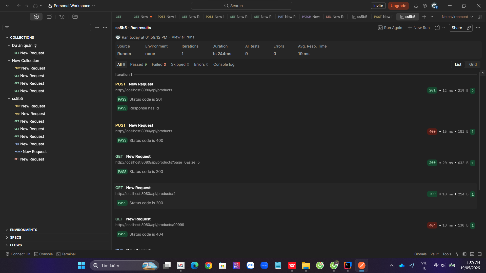

| Endpoint | Method | Mô tả | Request body mẫu | Response body mẫu (thành công) | Status codes |
| :--- | :---: | :--- | :--- | :--- | :--- |
| `/products` | **`GET`** | Lấy tất cả | Không có | `[ {"id":1, "name":"Bút", "price":5000} ]` | `200`, `500` |
| `/products/{id}` | **`GET`** | Lấy theo id | Không có | `{"id":1, "name":"Bút", "price":5000}` | `200`, `404` |
| `/products` | **`POST`** | Tạo mới | `{"name":"Sách", "price":30000}` | `{"id":2, "name":"Sách", "price":30000}` | `201`, `400` |
| `/products/{id}` | **`PUT`** | Cập nhật toàn bộ | `{"name":"Sách cải tiến", "price":35000}` | `{"id":2, "name":"Sách cải tiến", "price":35000}` | `200`, `400`, `404` |
| `/products/{id}` | **`PATCH`** | Cập nhật một phần | `{"price":32000}` | `{"id":2, "name":"Sách", "price":32000}` | `200`, `400`, `404` |
| `/products/{id}` | **`DELETE`** | Xóa sản phẩm | Không có | *Không có body trả về (Trống)* | `204`, `404` |

